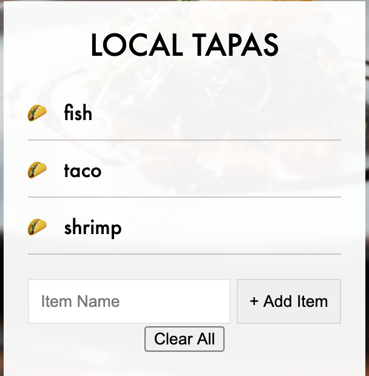

# Tapas Menu
> Add your food to the order and 'taco' it!

## Table of contents
* [General info](#general-info)
* [Screenshots](#screenshots)
* [Technologies](#technologies)

## General info
Adding items to a menu and 'taco-ing' them with a special checkbox. In the code, I explored saving items to local storage and how a website can benefit from it.

## Screenshots

## Technologies
Vanilla javascript
